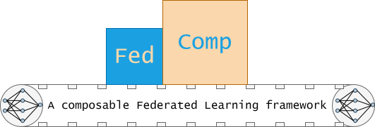

# 

## What is FedComp?

FedComp is a composable Federated Learning framework with built-in simulation capabilities and load testing tools written in Python. 

## Why FedComp is necessary?

## Philosophy

## Usage

## Contribute
